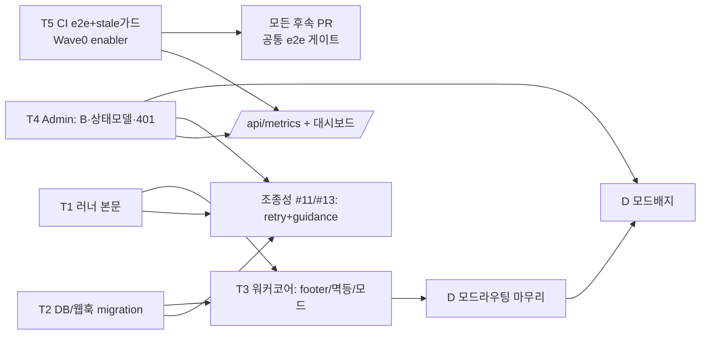

# PatchPilot — 경험 리뷰 & 개선 계획

> 작성: 2026-06-21 · 대상 브랜치: `main` (`bc4b054`, PR #8 rich-PR-body + PR #9 cancel-list 머지 후)
> 방법: 실제 모드(`EXECUTOR_MODE=gstack`, `PUBLISHER_MODE=github`, 대상 `Juyeong-Byeon/test_pr_repo`) 전체 flow 트리거 + UI/UX·PM·AX·워크플로우 4개 전문가 관점 리뷰의 종합.

---

## 0. TL;DR

PatchPilot은 **신뢰의 토대(격리·증거 사슬·정책 게이트·감사 스키마)는 동급 MVP 중 드물게 성숙**하다. 단일패스로 ~1분48초에 실제 PR을 뽑는 속도도 입증됐다. 그러나 **"audited PR out"이라는 핵심 약속이 사람이 실제로 보는 표면(PR 본문, Job Detail, 실패 설명)에서 무너진다.** 즉 *에이전트가 거짓말 못 하게* 막는 데는 성공했지만, *에이전트가 한 일을 사람에게 설득력 있게 보여주고 사람이 되받아 지시하게* 만드는 협업 UX가 비어 있다.

가장 치명적인 5가지(모든 관점이 수렴):

1. **PR 산출물 신뢰도 붕괴 (P0)** — single-pass PR 본문은 하드코딩 4줄, 스펙이 약속한 platform footer(티켓/job/run id·SHA·정책·테스트)가 publisher에 미주입. single-pass의 `tests:"passed"`는 아무 검증도 안 한 **가짜 통과 신호**.
2. **감독 불가능한 Job Detail (P0)** — 콘솔이 티켓 원문·DoD를 **전혀 렌더하지 않음**(데이터는 다 내려오는데 표시만 누락). 리뷰어가 기준선 없이 DoD 충족을 판단해야 함.
3. **상태 정합성 구멍 (P0)** — `transitionJob`에 동시성 가드가 없어 취소·머지가 터미널 상태를 덮어씀(실DB에 `CancelRequested→Completed` 흔적). merge 웹훅 유실 시 화해(reconcile) 부재로 영구 `NeedsReview` 고착. publish 비원자성으로 중복 PR/고아 브랜치 위험.
4. **조종성(steering) 부재 (P0/P1)** — 운영자가 에이전트를 재지시·교정할 수단 전무. retry는 동일 스냅샷 무수정 재생이며 에이전트 품질 실패(FailedActionable)엔 retry조차 막힘.
5. **라이프사이클 자동화 공백 (P0)** — CI에 e2e/스모크가 0건, stale-image 함정을 사람 규율에만 의존. dev→merge 회귀를 자동으로 못 잡음(이번 세션에서도 재빌드 누락으로 stale 이미지 위에 잡이 돌 뻔함).

아래 §3 백로그와 §4 단계별(개발→테스트→리뷰→PR/머지→e2e) 실행 계획으로 정리한다.

---

## 1. 리뷰 방법 & 실증 데이터

### 1.1 트리거한 실제 런

| 런 | 모드 | 결과 | 소요 | 관찰 |
| --- | --- | --- | --- | --- |
| `job_098c76cd` (PR #8 발행) | single-pass (`codex-agent-runner.js`) | Completed/NeedsReview, [test_pr_repo#8](https://github.com/Juyeong-Byeon/test_pr_repo/pull/8) | ~1m48s | PR 본문 4줄, 이벤트 6개(phase당 1), 로그 다수 빈 메시지 |
| `job_126f234a` | staged (`gstack-staged-runner.js`, 재빌드 이미지) | _§1.3에서 갱신_ | _진행_ | _§1.3에서 갱신_ |

### 1.2 single-pass 실증 — PR #8 본문 전문

```
## Summary
- Implemented by Codex CLI through the Ticket-to-PR runner.
- Changed files: CONTRIBUTING.md

## Verification
- git diff --name-only
```

→ 티켓/DoD 참조 0, 무엇을·왜 했는지 서사 0, 검증이라곤 `git diff --name-only`(실제 테스트 미실행). 이게 `apps/runner/src/codex-agent-runner.ts:265-273`의 정확한 출력이며 **현재 기본 경로**다.

### 1.2.1 관찰 정정 — "빈 로그 메시지"는 오탐 (강점으로 정정)

초기 조사에서 로그를 `message` 필드로 조회해 "다수 빈 메시지"로 보였으나, **실제 로그 텍스트 필드는 `text`**이며 내용은 충실하다. 단일패스 `job_438d52bb`의 실제 로그(9건, 전부 비어있지 않음):

```
[계획] 작업자가 티켓과 저장소 정책을 확인하고 있습니다.       (worker/progress)
Starting runner job ... / Checked out ... at <sha>            (gstack/stdout)
[구현] 실행 워크스페이스를 준비하고 AI runner를 시작합니다.   (gstack/progress)
Runner completed: head=<sha> changed=...                     (gstack/stdout)
[정책 검사] 변경 파일과 저장소 허용 정책을 검사하고 있습니다. (policy/progress)
[게시] 브랜치를 푸시하고 PR을 생성하고 있습니다.              (publisher/progress)
[완료] PR 생성이 끝났습니다.                                  (worker/progress)
```

→ **로그는 한국어 stage 마커 + source 태그로 잘 설계돼 있어 디버깅에 유용하다(강점).** 따라서 §2 매트릭스의 "빈 로그 메시지" 항목과 4개 리뷰가 이 잘못된 관찰에 의존해 제기한 부분은 **철회**한다. (4개 전문가 에이전트에 제공한 입력 데이터에 이 오류가 섞여 있었음을 명시한다.) 단, `LogViewer.tsx`의 `line.text ?? ""` 방어 코드 자체는 무해하며 유지해도 무방하다.

### 1.3 staged 실증 (재빌드 이미지, WIP 머지본) — `job_126f234a` → [test_pr_repo#9](https://github.com/Juyeong-Byeon/test_pr_repo/pull/9)

티켓: "완료 항목 일괄 삭제 버튼 추가"(Priority=High, DoD 4항목). 결과: **~16분30초**(single-pass ~1m48s 대비 **~9× wall-clock**), Completed/NeedsReview, 1파일 +10/-5(테스트만).

**좋았던 점 (staged가 single-pass보다 확실히 우수):**
- **컨텍스트 주입 깔끔**: `input/ticket.md`에 title/description/DoD/repo/branch가 그대로 전달됨.
- **plan.md에 DoD 매핑**: 에이전트가 레포를 점검해 "기능이 이미 구현돼 있음"을 발견하고 e2e 강화로 방향 전환. `## Definition of Done Mapping` 섹션으로 각 DoD 항목→충족 상태 명시.
- **review.md가 진짜 리뷰**: "Plan Completion Audit"(5/5 DONE, 파일:라인 증거), "Pre-Landing Review"(SQL/race/trust-boundary 카테고리 점검). 사람 리뷰어에게 실질적 근거.
- **qa.json 실검증**: `{"passed":true,"command":"npm run ci",...}` — `npm test/secrets:scan/format:check/lint/typecheck/build`를 **실제로** 돌림(가짜 `git diff --name-only` 아님).
- **신뢰 증거 아티팩트 완비**: `baseSha=7092a07…`, `headSha=9a067b6…`, `changedFiles=['tests/todo.e2e.test.ts']`, `policy: passed, deniedFiles:[]`.

**실증으로 드러난 결함:**
- **(신규 P1) 광고된 라이브 sub-stage 관찰성이 실제로 안 뜸.** README는 "live gstack sub-stage(예: 리뷰 3/4) + 로그 스테이지 divider"를 약속하지만, **16분 staged 런의 로그에 단계 배너가 0건**. single-pass와 **동일한** 9개 generic 진행 마커(`[계획]`/`[구현]`/`[정책 검사]`/`[게시]`/`[완료]`)만 떴고, 러너 내부 plan/implement/review/verify stdout은 로그 파이프라인에 스트리밍되지 않았다(완료 후 `Runner completed: head=…` 한 줄만 stdout 캡처). audit-events도 16분간 3건(Queued/Planning/Implementing)뿐 → **운영자는 16분 내내 "Implementing"만 응시**. 풍부한 단계 정보는 *완료 후 PR 본문*에만 나타남.
- **(N1 강화) 레거시 하드코딩 블록이 staged 본문 맨 위에 그대로 prepend → 모순.** `writeResultArtifacts`가 rich 섹션 앞에 `## Summary / Implemented by Codex CLI / Changed files / ## Verification / git diff --name-only`를 붙인다. 같은 PR 안에서 위쪽 "Verification: git diff --name-only"(가짜)와 아래쪽 `## 테스트 전략`·`## Verification (gstack verify)`(실제 `npm run ci` 통과)가 **정면 충돌**. 리뷰어 신뢰를 깎는 자기모순.
- **(N1 확정) 신뢰 증거가 본문엔 없음.** 위 아티팩트의 SHA/정책 verdict/실 tests가 **PR 본문 어디에도 없다**. 데이터는 다 있는데 publisher가 footer로 합성하지 않을 뿐 → N1이 정확히 이 갭.
- **(신규 P2) review 단계가 최신 origin/main을 fetch 못 함.** review.md: "git fetch origin main failed because the remote requested GitHub credentials … Review used the existing local origin/main ref." 러너에 GitHub 토큰 미주입(보안상 정상)이라, 리뷰가 **stale 로컬 ref** 대비로 수행될 수 있음. 베이스가 갱신된 경우 리뷰 정확도 저하.

> 결론: staged는 *산출물 품질*(plan/review/qa·DoD 매핑·실검증)에서 single-pass를 압도하지만, **(a) 그 풍부함이 진행 중엔 안 보이고(관찰성 미작동), (b) 완성된 본문조차 레거시 가짜 블록과 모순되며, (c) 신뢰 증거가 본문에 합성되지 않는다.** 즉 "좋은 작업을 했는데 사람에게 그 사실을 제때·일관되게 보여주지 못한다" — AX 핵심 갭의 생생한 실례.

---

## 2. 4개 전문가 관점 종합 (수렴 매트릭스)

| 이슈 | UI/UX | PM | AX | 워크플로우 | 종합 심각도 |
| --- | :-: | :-: | :-: | :-: | :-: |
| PR 본문/산출물 신뢰도(footer·가짜 tests·서사) | ● | ●●● | ●●● | ● | **P0** |
| Job Detail에 티켓/DoD/diff/정책증거 미표시 | ●● | ●● | ●●● | – | **P0** |
| 상태 전이 동시성 가드 부재(취소/머지 경합) | ● | – | – | ●●● | **P0** |
| 운영자 상태모델 이중배지(Completed+NeedsReview) | ●●● | – | – | ● | **P0** |
| merge 웹훅 유실 → 드리프트, reconcile 부재 | – | ● | – | ●●● | **P0** |
| publish 비원자성 → 중복 PR/고아 브랜치 | – | – | – | ●●● | **P0** |
| 모드 선택(single/staged)이 deploy-env에 고정 | – | ●●● | ●● | ● | **P0** |
| 조종성/교정 루프 부재(retry=무수정 재생) | ● | ● | ●●● | – | **P1** |
| 토큰 만료 401 전역 미처리 | ●●● | – | – | – | **P0** |
| 신뢰 증거가 raw JSON으로만 노출 | ●● | ●● | ●● | – | **P1** |
| 제품/사업 메트릭 부재 | – | ●●● | – | ● | **P1** |
| ~~빈 로그 메시지 노출~~ → **정정: 오탐**(아래 주) | – | – | – | – | **취소** |
| single-pass 에이전트 추론 비가시 + 죽은 phase(no self-review) | ● | – | ●● | ● | **P1** |
| **(실증) staged 라이브 sub-stage 관찰성 미작동** — 16분간 단계배너 0 | ●● | – | ●● | ●● | **P1** |
| **(실증) PR 본문 레거시 가짜 블록이 rich 섹션과 모순** | ● | ●● | ●●● | – | **P0** |
| **(실증) review 단계가 stale 로컬 base ref 대비**(토큰 미주입) | – | – | ● | ●● | **P2** |
| BullMQ 재시도/dedup/동시성 미설정 | – | – | – | ●●● | **P1** |
| 워크스페이스 GC/retention/heartbeat 미구현 | – | – | – | ●●● | **P1** |
| pre-exec 게이트 약함 + secret-scan 미구현(스펙 약속) | – | ●● | ● | ●● | **P1** |
| 접근성(대비/색의존)·반응형·다크모드 | ●●● | – | – | – | **P2** |
| 데드 i18n/죽은 상태 정리 | ●● | – | – | ● | **P2** |
| Lark 웹훅 헤더시크릿(본문 HMAC 아님) | – | – | – | ●● | **P2** |
| 온보딩 real-mode 복잡도(time-to-value) | – | ●● | – | – | **P2** |

(●●● 강하게 제기 · ● 언급)

각 관점의 한 줄 결론:
- **UI/UX**: 시각 완성도는 상위권이나 정보 위계·상태 일관성·에러 경계에 구멍. "감사 가능한 자동화"라는 약속을 화면이 부분적으로 배신.
- **PM**: 거버넌스 해자는 견고하나 **핵심 가치가 산출물(PR)에서 증발**하고 ROI를 보여줄 메트릭이 없어 채택 논거가 약함.
- **AX**: 신뢰의 *토대*는 있으나 그 위의 *legibility(가독성)·steerability(조종성)* 가 비어 협업 경험이 미완.
- **워크플로우**: 골격은 좋으나 **동시성·부분실패·드리프트** 가드가 없고 라이프사이클(재빌드→테스트→e2e)이 자동화되지 않음.

---

## 3. 우선순위 백로그

### Now — 신뢰 입증의 최소 코어 (이번 사이클)

| # | 항목 | 심각도 | 근거 파일 |
| --- | --- | :-: | --- |
| N1 | **Platform 신뢰 footer 무조건 주입** (티켓/DoD·job/run·base..head SHA·정책 통과항목·tests 요약). 에이전트 본문과 독립. | P0 | `apps/worker/src/publisher-github.ts:42-50`, spec `docs/superpowers/specs/2026-06-19-...md:466` |
| N2 | **single-pass 가짜 `tests:"passed"` 제거** → `skipped`로, 정책 게이트가 "검증 없음"을 표면화 | P0 | `apps/runner/src/codex-agent-runner.ts:244-249`, `apps/worker/src/policy-gate.ts:71` |
| N3 | **Job Detail에 티켓/DoD 패널** (데이터·API 이미 있음, 타입·렌더·i18n만) | P0 | `packages/db .../repositories.ts getJob`, `apps/admin/src/api.ts`, `apps/admin/src/components/JobDetail.tsx` |
| N4 | **정책·검증 증거 카드** (changedFiles·deniedFiles·tests·target-branch·SHA를 배지로; raw JSON 대체) | P1 | `apps/admin/src/components/JobDetail.tsx:284-344` |
| N5 | **상태 전이 낙관적 가드** `where phase=<from>` + 터미널 불변(취소/머지가 터미널 덮어쓰기 금지) | P0 | `packages/db .../repositories.ts:84,274,449`, `worker.ts:433` |
| N6 | **운영자 상태모델 단일화** (outcome SSoT, Completed+NeedsReview 이중배지 해소, "리뷰 대기" 전용 칩) | P0 | `apps/admin/src/components/JobDetail.tsx:124`, `apps/admin/src/lib/status.ts:15` |
| N7 | **전역 401/세션만료 경계** (silent 폴링 에러 삼킴 제거, 재인증 유도, 폴링 중단) | P0 | `apps/admin/src/App.tsx:155-191` |
| N8 | **CI에 mock e2e 스모크** (compose up + Lark 웹훅 1건 → NeedsReview 도달 폴링) | P0 | `.github/`, `apps/runner/dist/e2e-smoke-runner.js` |
| N9 | **(실증) 레거시 하드코딩 Summary/Verification 블록 제거** — rich 섹션과 모순(가짜 "git diff --name-only" vs 실 `npm run ci`). single/staged 모두 단일 본문 빌더로 통일 | P0 | `apps/runner/src/*` `writeResultArtifacts`(body 조립) |

### Next — ROI 가시성 + 마찰 제거 (다음 분기)

| # | 항목 | 심각도 |
| --- | --- | :-: |
| X1 | **merge 웹훅 멱등 적재 + NeedsReview reconcile 폴러** (`webhook_events` 활용) | P0 |
| X2 | **publish 멱등화**(기존 open PR 재사용) + `(repo,pr_number)` 유니크 + 고아 브랜치 정리 | P0 |
| X3 | **모드 라우팅**: `Priority=High`→staged 자동, Lark "Pipeline" 필드, 콘솔 모드 배지 | P0 |
| X4 | **에이전트 조종성**: retry에 operator guidance 입력, `failure.json` 구조적 실패, FailedActionable 재실행 허용 | P1 |
| X5 | **`/api/metrics` + 오너 대시보드** (성공률·p50/p95·머지율·재시도율·모드분포) | P1 |
| X6 | **BullMQ `defaultJobOptions`·removeOnFail·enqueue jobId dedup + 실행중복 advisory lock** | P1 |
| X7 | **pre-execution 게이트 강화**(target-branch·protected-path 조기차단) + secret-scan 실구현 또는 문구 정정 | P1 |

### Later — 해자 확장

| # | 항목 | 심각도 |
| --- | --- | :-: |
| L1 | 워크스페이스 GC + `FAILED_WORKSPACE_RETENTION_DAYS` 실구현 + run heartbeat/stuck reconcile + 고아 컨테이너 sweep | P1 |
| L2 | single-pass 최소 self-review/verify 옵션화 + 죽은 `Reviewing`/`Testing` phase 정리 | P1 |
| L3 | diff 임베드/딥링크(콘솔에서 변경 자체 확인) | P2 |
| L4 | 접근성 패스(배지 대비 AA·상태 아이콘·색비의존) + 모바일 카드 폴백 + 다크모드 | P2 |
| L5 | 데드 i18n/죽은 상태 정리, Lark 본문 서명/타임스탬프, 시크릿 회전 런북 | P2 |
| L6 | GitHub App 인증(PAT 운영부담 제거, 멀티-repo) | P2 |
| L7 | doctor real-mode preflight(Codex/gstack 마운트 검증) — time-to-value | P2 |
| L8 | **(실증) staged 러너 stdout 스트리밍 → 라이브 sub-stage/divider 실작동** (현재 16분간 단계배너 미표출; 러너 per-stage stdout을 로그 파이프라인으로 흘려 `detectStageBanners`가 실데이터를 받게) | P1 |
| L9 | **(실증) review 단계 base ref 신선도** — 토큰 미주입으로 fetch 실패 시, 플랫폼이 신뢰 baseSha를 read-only로 주입하거나 review가 `baseSha`를 명시 비교 | P2 |

---

## 3.5 병렬 작업 전략 (트랙 분할 · 의존성 · 머지 순서)

에픽을 **파일 소유권** 기준으로 5개 트랙으로 나눈다. 핵심 제약은 `apps/worker/src/worker.ts`·`publisher-github.ts`가 에픽 A·C·D에 동시에 걸리고, `JobDetail.tsx`/`i18n.ts`/`status.ts`가 admin 작업끼리 겹친다는 점이다. 이 핫스팟을 **단일 트랙이 독점**하게 해 충돌을 없앤다.

### 트랙 분할 (소유 파일 기준)

| 트랙 | 소유 파일(독점) | 포함 작업 | 다른 트랙과 동시 가능? |
| --- | --- | --- | --- |
| **T1 · 러너/산출물** | `apps/runner/src/*` (codex/staged runner, `writeResultArtifacts`) | A(러너측 본문: 레거시 블록 제거·에이전트 저작·`tests=skipped`), #13(`failure.json` 구조적 실패) | ✅ 완전 독립 |
| **T2 · DB/계약/웹훅** | `packages/db/src/*`(repositories·schema·migrate), `apps/api/src/github-webhook.ts`, `packages/core/src/result-schema.ts` | C(전이 가드·터미널 불변·migration·`webhook_events` 멱등·reconcile), #5 | ✅ 완전 독립 |
| **T3 · 워커 코어(직렬)** | `apps/worker/src/{worker,publisher-github,policy-gate,env,executor-gstack}.ts` | A(플랫폼 footer 합성)+C(publish 멱등·순서)+D(모드 선택)+#17(pre-exec 게이트) | ⚠️ 핫스팟 독점, 내부 순차 |
| **T4 · Admin/UX** | `apps/admin/src/*` | B(티켓/DoD·증거 카드)+상태모델 단일화·이중배지·401(App.tsx)+D 모드 배지+quick wins+메트릭 대시보드 | ✅ 백엔드와 독립(내부 순차) |
| **T5 · 플랫폼/CI** | `.github/`, `scripts/`, `docker/`, `apps/api/src/routes-admin.ts`(메트릭 라우트) | E(mock e2e 게이트·stale-image 가드), #14(`/api/metrics`) | ✅ 완전 독립 |

### 충돌 핫스팟 & 소유권 규칙
- **`worker.ts`·`publisher-github.ts` → T3 단독.** A의 footer 합성, C의 publish 멱등, D의 모드 선택은 *전부 T3에서* 수행(다른 트랙이 이 두 파일을 건드리지 않음).
- **`JobDetail.tsx`·`i18n.ts`·`status.ts` → T4 단독**, 내부 순차(B → 상태모델 → 배지).
- **러너 본문 seam**: T1이 레거시 `## Summary/Verification` 블록을 제거 → T3가 그 위에 footer를 합성. **T1을 먼저 머지**하고 T3가 리베이스.
- **i18n 키 추가는 additive** — 충돌나도 trivial(머지 시 양쪽 키 보존).

### 머지 순서 (의존성 그래프)



### 웨이브(동시 실행 단위)

- **Wave 0 (즉시 시작, 단독 enabler)** — **T5의 mock e2e 게이트 + stale-image 가드**. 먼저 깔아야 이후 모든 트랙 PR이 공통 e2e 게이트를 통과한다(이번 세션의 재빌드-누락 교훈을 제도화).
- **Wave 1 (4갈래 동시 진행)** — **T1 ∥ T2 ∥ T4(B·상태모델·401) ∥ T3 착수**. 파일 겹침 0이라 4명/4에이전트가 병렬 작업 가능. 머지 순서만: `T2 migration → T1 러너본문 → T3(footer+멱등)`; T4는 백엔드와 무관하게 독립 머지.
- **Wave 2 (Wave1 의존)** — **D 모드라우팅 마무리**(T3 worker + T4 배지), **메트릭**(T5 라우트 + T4 대시보드), **조종성**(T1 `failure.json` + T2 repo + T4 retry UI). 이 셋도 서로 파일이 달라 **상호 병렬** 가능.

### 한눈 요약 — 지금 당장 병렬로 띄울 수 있는 것
> **T1 · T2 · T4 · T5는 파일 겹침이 0이라 4개를 동시에 착수**할 수 있다. T3(워커 코어)만 T1/T2 머지에 의존해 살짝 뒤따른다. 즉 "신뢰 footer(A)·상태정합(C)·감독 UI(B)·CI e2e(E)"를 **4트랙 동시 진행** → 머지 게이트(T5)만 먼저 세우면 충돌 없이 합류한다.

---

## 4. 단계별 상세 실행 계획 (개발 → 테스트 → 리뷰 → PR/머지 → e2e)

> **트랙 배정**: 각 에픽 제목 옆 `[T#]`가 §3.5 트랙. 같은 트랙 = 순차, 다른 트랙 = 병렬.

> 각 에픽은 **하나의 PR(또는 소수 PR)** 단위로 머지하고, 모든 PR은 공통 게이트를 통과한다.
> **공통 PR 게이트**: `npm run typecheck && npm test && npm run build && npm run lint && git diff --check`, 그리고 **변경이 worker/runner를 건드리면 `npm run docker:refresh-runtime` 후 mock e2e 스모크**(이번 세션의 stale-image 교훈을 게이트로 강제).

### 에픽 A — 신뢰 가능한 PR 산출물 (N1·N2·N9) · `[T1 러너 + T3 워커]` · _AX·PM·UX_

목표: PR을 보는 순간 "무엇을·왜·DoD 충족·어떻게 검증·어떤 SHA가 감사됐는지"가 단일 PR 본문에서 읽힌다. **저작은 에이전트, 증거는 플랫폼** 분리.

- **개발(dev)**
  - publisher 레이어(`apps/worker/src/publisher-github.ts`)에 `composePrBody(agentBody, evidence)` 도입: 에이전트 본문 아래에 플랫폼이 직접 만든 **신뢰 footer** append — Lark record/job/run id, `targetBranch ← workBranch`, `baseSha..headSha`, 정책 게이트 통과 항목(allowlist/protected-path/branch/verification), `tests`(command·passed/skipped·summary), 티켓 DoD 체크리스트.
  - footer 데이터는 **신뢰 가능한 git/DB evidence**에서만 구성(에이전트 보고값 금지) — `collectTrustedGitEvidence`/policy artifact 재사용.
  - single-pass(`codex-agent-runner.ts:244-273`)도 동일 footer를 받도록 결과 계약 통일. `tests` 기본값 `"passed"` → `"skipped"`(N2). staged의 qa.json만 `"passed"` 가능.
  - **(N9, 실증) `writeResultArtifacts`의 레거시 하드코딩 `## Summary`/`## Verification(git diff --name-only)` 블록 제거.** 실증한 staged PR #9에서 이 블록이 rich 섹션 위에 prepend되어 가짜 "git diff --name-only"가 실제 `npm run ci` 통과와 모순됐다. single/staged가 **하나의 본문 빌더**(에이전트 prose + 플랫폼 footer)를 공유하게 통일.
  - (선택) single-pass에도 staged의 `document` 스테이지(6섹션) 1패스를 옵션화해 본문 prose를 에이전트가 저작.
- **테스트(test)**
  - 단위: `composePrBody`가 (a) footer를 **항상** 붙임, (b) 에이전트 본문이 비어도 footer는 풍부, (c) 시크릿이 footer에 새지 않음(masking)을 검증.
  - 스냅샷: single-pass / staged 두 경로의 본문 골든 스냅샷.
  - 회귀: `tests` 기본값이 `skipped`이고 policy-gate가 이를 "검증 없음"으로 분류하는지.
- **리뷰(review)**
  - 리뷰 포인트: footer가 **에이전트 입력이 아닌 플랫폼 evidence**만 쓰는가(위조 불가), 마스킹 경로, DoD 매핑의 정확성.
  - PR 템플릿에 "신뢰 신호 출처(platform-verified vs agent-claimed)" 체크박스.
- **PR/머지**
  - 브랜치 `feat/trust-grade-pr-body`. 공통 게이트 + worker/runner 변경이므로 **재빌드+mock e2e 필수**.
  - 머지 후 즉시 `npm run docker:refresh-runtime`.
- **e2e**
  - mock 모드 스모크 1건 → 생성된 mock PR 본문에 footer 6요소가 모두 존재하는지 assert.
  - real 모드 nightly 1건(디스포저블 레포) → 실제 PR 본문 육안 + 자동 grep(SHA 40자, 정책 통과 라인).

### 에픽 B — 감독 가능한 Job Detail (N3·N4) · `[T4 Admin]` · _AX·UX·PM_

목표: 리뷰어가 콘솔만으로 "받은 지시(티켓/DoD)"와 "한 일(변경·테스트·정책)"을 나란히 보고 머지 판단.

- **개발**
  - `apps/admin/src/api.ts`의 `JobRecord`에 `title/description/definitionOfDone/rawFields` 추가(이미 `getJob` SQL이 내려줌).
  - `JobDetail.tsx` 상단에 **티켓/DoD 패널** + (가능하면) DoD를 체크리스트로 파싱.
  - **정책·검증 증거 카드**: `changedFiles`(보호경로 위반 0 강조)·`tests`(command/passed/skipped)·target-branch 일치·감사 SHA를 색 배지로. 기존 raw `ArtifactPanel`(`:284-344`)은 "원본 보기"로 접어둠.
  - i18n 라벨 추가(KR/EN), 데드 i18n 키 정리(겸사).
- **테스트**
  - 컴포넌트 테스트: DoD 패널 렌더, 증거 카드가 deniedFiles 있을 때 경고색, tests=skipped일 때 "검증 없음" 명시.
  - 접근성: 증거 배지 색-비의존(아이콘 동반).
- **리뷰**: 데이터 출처가 신뢰 evidence인지, "agent 주장"과 "platform 검증"이 시각적으로 구분되는지.
- **PR/머지**: 브랜치 `feat/job-detail-supervision`. admin-only 변경(이미지 무관) → 공통 게이트 + `npm run dev:admin` 수동 확인.
- **e2e**: mock 스모크의 Job Detail을 헤드리스로 열어 DoD/증거 카드 DOM 존재 assert(Playwright 도입 시).

### 에픽 C — 상태 정합성 & 동시성 가드 (N5·X1·X2) · `[T2 DB/웹훅 + T3 워커]` · _워크플로우_

목표: 어떤 경합/유실/부분실패에도 상태가 진실과 어긋나지 않는다.

- **개발**
  - 모든 전이를 `update jobs set ... where id=$1 and phase=$expectedFrom`로 가드, `rowCount===0`이면 no-op + 경고 이벤트(`transitionJob`/`markPullRequestMerged`/`requestCancel`).
  - 터미널 상태(`Completed/Failed/Cancelled`)는 늦은 이벤트로 못 바뀌게 불변 가드. `Publishing` 진입 후 취소 체크 추가(또는 "취소 불가 구간" 명시).
  - `transitionPhase`(state.ts 화이트리스트)를 DB 쓰기 경로가 **실제로 호출**하도록 단일화(현재 우회).
  - merge 웹훅 멱등 적재: `webhook_events`에 delivery-id 유니크 INSERT(현재 테이블만 있고 미사용). `NeedsReview`+open PR 주기적 GitHub 폴링 reconcile 잡.
  - publish 멱등화: `pulls.create` 전 `head:base`로 기존 open PR 조회 후 재사용, `(repository, pr_number)` 유니크 제약, 재시도 전 고아 브랜치 정리/force-with-lease.
- **테스트**
  - 통합(pg-mem/testcontainers): `취소-during-Publishing`, `늦은-merge-after-terminal`, `중복-merge`, `push성공/PR실패`, `재시도-중복-PR` 시나리오. 실DB의 `CancelRequested→Completed`가 가드로 막히는지 재현 테스트.
- **리뷰**: 보상/멱등 계약을 코드 주석+PR 본문 체크리스트로 명시. 전이표 SSoT 문서 링크.
- **PR/머지**: 브랜치 `fix/state-integrity-guards`. DB 마이그레이션(유니크 제약·webhook_events 사용) 포함 → CI에 `db migrate` 드라이런 추가.
- **e2e**: mock 스모크에 merge 웹훅(모의 서명) 주입 → `Completed` 전이 확인. reconcile 폴러를 짧은 주기로 띄워 누락 웹훅 복구 검증.

### 에픽 D — 모드 라우팅 & 비용 제어 (X3) · `[T3 워커 + T4 배지]` · _PM·AX_

목표: 비개발 운영자가 티켓 단위로 비용/품질(single vs staged)을 self-serve로 제어.

- **개발**: worker가 잡의 `priority`(이미 존재, 현재 미사용)로 executor 선택 — `High→staged`, 그 외 `single`. Lark 티켓에 "Pipeline" 단일선택 필드 → per-ticket 라우팅. 콘솔 Job Detail/리스트에 **사용 모드 배지**.
- **테스트**: priority/필드 → executor 매핑 단위 테스트. 콘솔 배지 렌더.
- **리뷰**: 기본값 안전성(미지정 시 single), 비용 폭증 방지(High 남발 가드).
- **PR/머지**: `feat/per-ticket-pipeline-routing`. worker 변경 → 재빌드+e2e.
- **e2e**: mock 2건(High→staged 경로, Normal→single 경로)이 각 모드로 라우팅되는지.

### 에픽 E — 라이프사이클 자동화 (N8 + 프로세스) · `[T5 플랫폼/CI]` · _워크플로우_  ← §5와 연동 · **Wave 0 enabler**

목표: 코드 변경이 재빌드 누락/회귀 없이 안전하게 머지·배포된다(이번 세션의 stale-image 교훈 제도화).

- **개발**: (1) CI에 **mock e2e 스모크** 잡(아래 §5.5). (2) `docker:recreate-worker`가 이미지에 **git-sha 라벨**을 박고, 기동 시 라벨≠HEAD면 경고/거부하는 **stale-image 가드**. (3) dev용 bind-mount + `tsx watch` compose override(재빌드 우회).
- **테스트**: 가드 스크립트 단위 테스트(라벨 불일치 감지). 
- **리뷰**: CI 워크플로 변경 리뷰, 비밀 미노출(real e2e는 별도 시크릿·nightly).
- **PR/머지**: `chore/ci-e2e-and-stale-guard`. 
- **e2e**: 이 에픽이 곧 e2e 인프라 자체.

---

## 5. 개발 라이프사이클 자체 개선 (dev → test → review → PR/merge → e2e)

이번 세션에서 드러난 라이프사이클 마찰을 제도화한다.

### 5.1 dev — stale 이미지 함정 제거
- 증상: worker/runner는 **빌드된 이미지**에서 실행되어 라이브 체크아웃을 안 봄. 안전장치가 사람 규율(`npm run docker:refresh-runtime`)뿐. (이번 세션: 잡이 stale 이미지 위에서 돌 뻔함)
- 개선: 이미지에 `--label git-sha=$(git rev-parse HEAD)`. `npm run status`/worker 기동 시 라벨≠HEAD면 경고. dev 모드 bind-mount override 제공.

### 5.2 test — 경합/부분실패 커버리지
- 현재 단위 테스트는 두텁지만 **동시성·부분실패·드리프트** 시나리오가 0. 에픽 C의 통합 테스트로 보강. `DATABASE_URL` 라이브 시에만 도는 repo 테스트를 CI 서비스 컨테이너로 상시화.

### 5.3 review — 안전 계약 명시
- PR 템플릿에 체크리스트: ① 상태 전이/멱등/보상 ② 신뢰 신호 출처(platform vs agent) ③ worker/runner 변경 시 재빌드+e2e 수행 여부 ④ 마이그레이션 동반 시 드라이런.
- 전이그래프/결과계약을 단일 SSoT 문서로 유지(현재 `state.ts` 선언이 실제 코드보다 넓어 혼선).

### 5.4 PR/merge — 게이트 강화
- CI(`.github/`)에 현재 lint/typecheck/test/build에 더해: **`db migrate` 드라이런**(스키마 드리프트), **mock e2e 스모크**(아래), 머지 시 **이미지 빌드+태그** 파이프라인(수동 런북 → 자동).

### 5.5 e2e — 자동 스모크(가장 큰 공백)
- 현재 CI에 docker/compose/e2e 스텝 **0건**. 회귀 방지가 수동 런북 의존.
- 추가:
  - **mock e2e(게이트)**: `EXECUTOR_MODE=mock`/`PUBLISHER_MODE=mock`로 compose up(postgres/redis/api/worker) → Lark 웹훅 1건 POST → `/api/jobs` 폴링으로 `NeedsReview` 도달 + mock PR 본문 footer assert → merge 웹훅(모의 서명) → `Completed` 전이 assert. (`e2e-smoke-runner.js` 이미 존재 — 연결만)
  - **real e2e(nightly)**: 디스포저블 allowlist 레포 대상 single + staged 각 1건, 실패 시 알림.

---

## 6. 메트릭 & 성공 기준

도입할 핵심 지표(데이터는 이미 jobs/events/pull_requests 테이블에 존재 — 집계만):

- **잡 성공률** = NeedsReview 도달/전체 (실패 4분류 policy·agent·publish·infra별 분해)
- **소요시간** p50/p95 (Queued→NeedsReview)
- **PR 머지율** = merged/NeedsReview (merge 웹훅 활용 — 자동화의 *진짜* 가치 지표)
- **재시도율** 및 재시도 후 성공률
- **비용 대용지표** = 모드 분포(single vs staged) × 잡수 (staged ≈ 4–5×)
- **정책 차단율** = FailedActionable(policy)/전체
- **Time-to-first-PR**(온보딩), **취소 성공률**(mid-run 취소가 실제 러너를 멈추는가)

에픽별 완료 기준(예):
- A: 임의 PR 본문에서 footer 6요소 자동 grep 통과 + `tests=skipped`가 가짜 통과로 안 보임.
- B: Job Detail에서 DoD·증거 카드 없이 머지 판단하던 흐름이 제거됨(사용성 테스트).
- C: §4-C의 5개 경합 시나리오 통합 테스트 그린 + 실DB 재현 케이스 가드됨.
- E/5.5: 머지 차단되는 mock e2e가 CI에 상시 그린.

---

## 부록 — 핵심 파일 레퍼런스

- 빈약한 single-pass 본문 / 가짜 tests: `apps/runner/src/codex-agent-runner.ts:244-273`
- staged 6섹션 본문 저작(머지됨): `apps/runner/src/gstack-staged-runner.ts:191-233,269-295`
- footer 미주입: `apps/worker/src/publisher-github.ts:42-50` · 스펙 약속: `docs/superpowers/specs/2026-06-19-ai-ticket-to-pr-agent-platform-design.md:466`
- 정책 게이트: `apps/worker/src/policy-gate.ts:29-87`
- 무가드 상태 전이: `packages/db/.../repositories.ts:84,274,449` · `apps/worker/src/worker.ts:433`
- merge 웹훅/`webhook_events` 미사용: `apps/api/src/github-webhook.ts`, `packages/db schema.sql:106`
- 이중배지/상태 매핑: `apps/admin/src/components/JobDetail.tsx:124-125` · `apps/admin/src/lib/status.ts:15-31`
- 폴링/401 삼킴: `apps/admin/src/App.tsx:155-191`
- 로그 렌더(정정: 로그 text는 정상 채워짐, 방어코드만): `apps/admin/src/components/LogViewer.tsx:115-122`
- 로그 text 필드(stage 마커 정상): `job_logs.text` (API 키 `text`, `message` 아님)
- 메트릭 부재(라우트): `apps/api/src/routes-admin.ts:51-70`
- 모드 결정 env: `apps/worker/src/executor-gstack.ts:72`, `apps/worker/src/index.ts:29`
